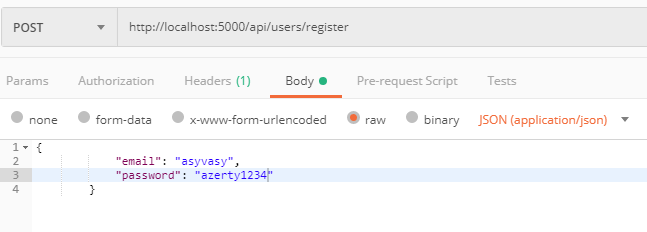

# passport-jwt-mysql

Initialisation du projet :

```

git clone https://github.com/AsyVasy/passport-jwt-mysql

```

### import database from ./dbScripts/passport-auth.sql and name it: 'passport-auth'

``` 
npm install

npm run start-dev

use postman to test routes

```

<!--  -->

# Description des fichiers:

## users.controller.js

Ici on déclare les fonctions a exécuter lorsqu'une méthode est appelé a la route défini.
```javascript
// routes
router.post("/authenticate", authenticate);
router.post("/register", register);
```

<!--  -->

La fonction authenticate est défini ici, elle appelle la fonction authenticate importéE depuis users.service.js et renvoi une réponse.

```javascript
function authenticate(req, res) {
    userService
        .authenticate(req.body, result => {
            result.success ? res.status(201).json(result) : res.status(401).json(result);
        })
}
```
<!--  -->

<!--  -->

La fonction register est définit ici, elle appelle la fonction register importée depuis users.service.js est renvoi une reponse.

```javascript
function register(req, res) {
  userService
        .register(req.body, result => {
          result.success ? res.status(201).json(result) : res.status(401).json(result);
        })
}
```
<!--  -->

## user.service.js

La fonction authenticate prend un objet contenant un email et un password puis une fonction callback en parametre. Elle utilise l'email fournit avec la fonction db.findUser importer depuis ./app/helpers/db.js pour verifier si les identifiants existent en base de données puis stocks toutes les infos de l'user dans un objet.

Ensuite, elle utilise le password fournit avec la fonction crypt.compareHash, importée depuis ./app/helpers/crypt.js pour décrypter et vérifier si le password est correcte ou non. Si il est correcte, l'user authentifié obtient un token valable pendant 10000 secondes.

La fonction callback permet d'envoyer une reponse, en fonction du statut de l'authentification (success, fail ...)

```javascript
function authenticate({ email, password }, callback) {
    db.findUser({
        email: email
    }, function (res) {
        var user = {
            user_id: res.user_id,
            user_email: res.user_email,
            is_active: res.is_active,
            user_type: res.user_type
        };

        // Check if password matches
        crypt.compareHash(password, res.password, function (err, isMatch) {
            if (isMatch && !err) {
                // Create token if the password matched and no error was thrown
                var token = jwt.sign(user, config.secret, {
                    expiresIn: 10080 // in seconds
                });
                return callback({ success: true, token: token });
            } else {
                return callback({
                    success: false,
                    message: 'Authentication failed. Passwords did not match.'
                });
            }
        });
    }, function (err) {
        return callback({ success: false, message: 'Authentication failed. User not found.' });
    });
}
```

<!--  -->

La fonction register prend un objet userParam et une fonction callback en parametre.
Si l'objet userParam n'est pas complet, avec des clés/valeurs demandées, la fonction callback renvois un status false avec un message d'erreur.
Sinon, un objet newUser est crée avec les informations fournient.
La fonction db.createUser est appelé pour entrer ce nouvel user en base de données. Cette fonction permet également de verifier si l'email fournit est déjà utilisé.

```javascript
function register(userParam, callback) {
    if (!userParam.email || !userParam.password) {
        return callback({ success: false, message: 'Please enter email and password.' });
    } else {
        var newUser = {
            email: userParam.email,
            password: userParam.password
        };

        // Attempt to save the user
        db.createUser(newUser, function (res) {
            return callback({ success: true, message: 'Successfully created new user.' });
        }, function (err) {
            return callback({ success: false, message: 'That email address already exists.' });
        });
    }
}
```
<!--  -->

# Exemple d'utilisation des routes avec Postman

## register user

Pour enregister un nouvel utilisateur, uiliser la methode POST à l'url suivante:
<http://localhost:5000/api/users/register>

Se rendre dans la section "Body > raw > JSON (application/json)" pour pouvoir poster votre user comme ci-dessous.



En cas de succes, le serveur nous renvois un json notifiant la création de l'user.


Les logs serveur nous permettent également de constater qu'une méthode POST est utilisé à la route /api/users/register et que le serveur nous renvois un 201.


<!-- ## authenticate user

 -->

<!--
## CreateHash lors du register

CompareHash lors de l’authenticate

Création d’un token JWT lors de l’authenticate

Vérification du token avec passport & jwt-passport pour accéder à certaines routes

## Liste des routes disponibles :


<http://localhost:5000/api/users/authenticate>

<http://localhost:5000/api/dashboard> -->
