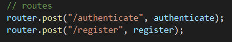
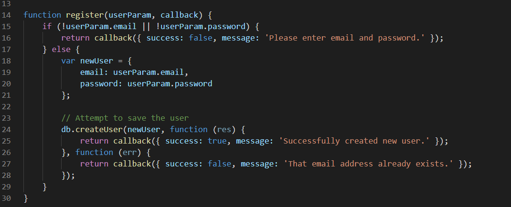

# passport-jwt-mysql

Initialisation du projet :

```

git clone https://github.com/qdanneville/passport-jwt-mysql

npm install

npm run start-dev

```


## users.controller.js

Ici on déclare les fonctions a executer lorsqu'une méthode est appelé a la route définit.



La fonction authenticate est définit ici, elle appelle la fonction authenticate importé depuis users.service.js est renvoi une reponse.


La fonction register est définit ici, elle appelle la fonction register importée depuis users.service.js est renvoi une reponse.


## user.service.js

La fonction authenticate prend un objet contenant un email et un password puis une fonction callback en parametre. Elle utilise l'email fournit avec la fonction db.findUser importer depuis ./app/helpers/db.js pour verifier si les identifiants existent en base de données puis stocks toutes les infos de l'user dans un objet.

Ensuite, elle utilise le password fournit avec la fonction crypt.compareHash, importée depuis ./app/helpers/crypt.js pour décrypter et vérifier si le password est correcte ou non. Si il est correcte, l'user authentifié obtient un token valable pendant 10000 secondes.

La fonction callback permet d'envoyer une reponse, en fonction du statut de l'authentification (success, fail ...)


La fonction register prend un objet userParam et une fonction callback en parametre.
Si l'objet userParam n'est pas complet, avec des clés/valeurs demandées, la fonction callback renvois un status false avec un message d'erreur.
Sinon, un objet newUser est crée avec les informations fournient.
La fonction db.createUser est appelé pour entrer ce nouvel user en base de données. Cette fonction permet également de verifier si l'email fournit est déjà utilisé.



## Un register user


## CreateHash lors du register

CompareHash lors de l’authenticate

Création d’un token JWT lors de l’authenticate

Vérification du token avec passport & jwt-passport pour accéder à certaines routes

## Liste des routes disponibles :

<http://localhost:5000/api/users/register>

<http://localhost:5000/api/users/authenticate>

<http://localhost:5000/api/dashboard>
