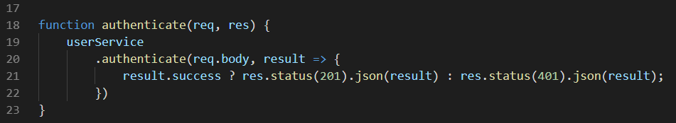

# passport-jwt-mysql

Initialisation du projet :

```
git clone https://github.com/qdanneville/passport-jwt-mysql

npm install

npm run start-dev
```


## Liste des concepts que vous trouverez dans ce projet :

Une authentification user



## Un register user


## CreateHash lors du register

CompareHash lors de l’authenticate
Création d’un token JWT lors de l’authenticate
Vérification du token avec passport & jwt-passport pour accéder à certaines routes

## Liste des routes disponibles :

<http://localhost:5000/api/users/register>

<http://localhost:5000/api/users/authenticate>

<http://localhost:5000/api/dashboard>
